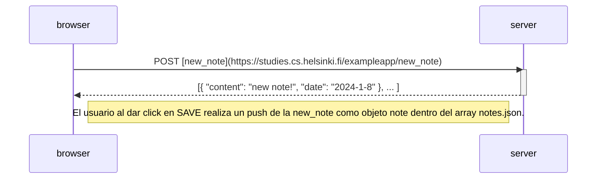
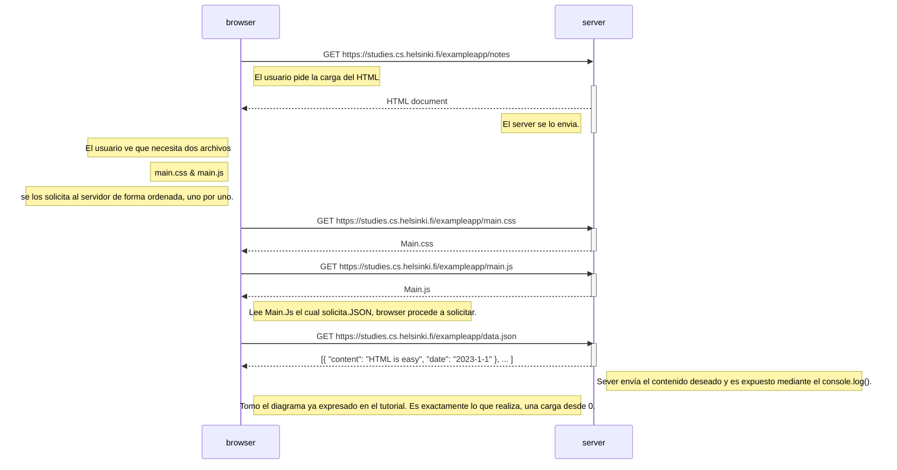

```mermaid
sequenceDiagram
    participant browser
    participant server

    browser->>server: POST [new_note](https://studies.cs.helsinki.fi/exampleapp/new_note)
    activate server
    server-->>browser: [{ "content": "new note!", "date": "2024-1-8" }, ... ]
    deactivate server

    Note right of browser: El usuario al dar click en SAVE realiza un push de la new_note como objeto note dentro del array notes.json.
```

```mermaid
sequenceDiagram
    participant browser
    participant server

    browser->>server: GET https://studies.cs.helsinki.fi/exampleapp/notes
    Note right of browser: El usuario pide la carga del HTML
    activate server
    server-->>browser: HTML document
    Note left of server: El server se lo envia.

    deactivate server
    Note left of browser: El usuario ve que necesita dos archivos
    Note left of browser: main.css & main.js
    Note left of browser: se los solicita al servidor de forma ordenada, uno por uno.
    browser->>server: GET https://studies.cs.helsinki.fi/exampleapp/main.css
    activate server
    server-->>browser: Main.css
    deactivate server
    browser->>server: GET https://studies.cs.helsinki.fi/exampleapp/main.js
    activate server
    server-->>browser: Main.js
    deactivate server
    Note right of browser: Lee Main.Js el cual solicita.JSON, browser procede a solicitar.

    browser->>server: GET https://studies.cs.helsinki.fi/exampleapp/data.json
    activate server
    server-->>browser: [{ "content": "HTML is easy", "date": "2023-1-1" }, ... ]
    deactivate server
    Note right of server: Sever envía el contenido deseado y es expuesto mediante el console.log().


    Note right of browser: Tomo el diagrama ya expresado en el tutorial. Es exactamente lo que realiza, una carga desde 0.
```
